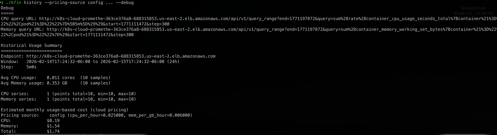
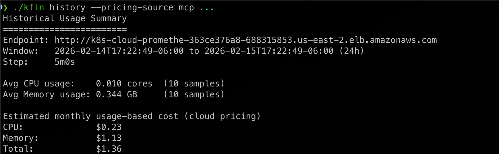
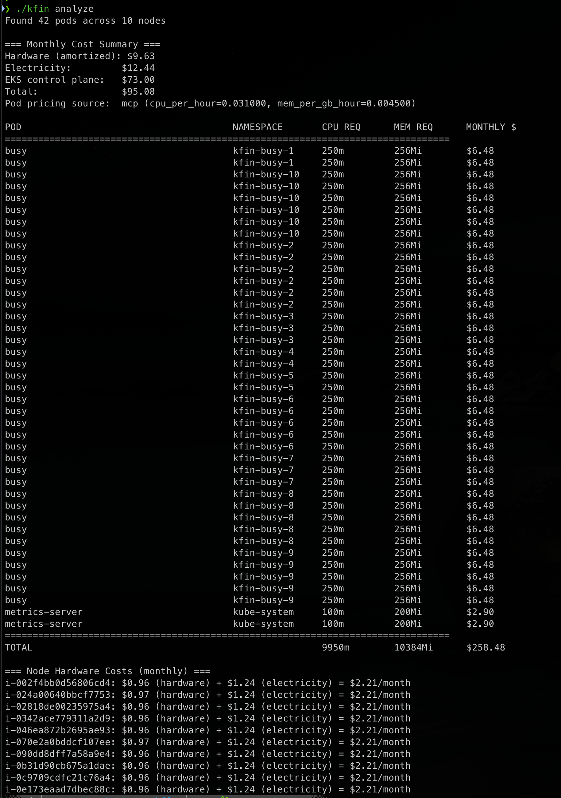
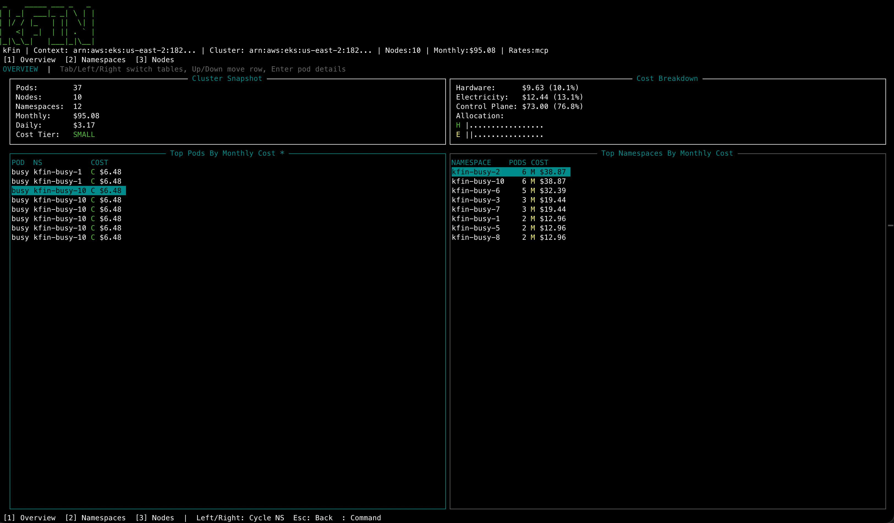

# kfin

[](https://github.com/sharksrus/kfin/actions/workflows/homebrew-tap.yml)

`kfin` is a Kubernetes cost visibility CLI with:
- terminal text analysis (`analyze`)
- historical usage analysis (`history`)
- interactive TUI dashboard (`tui`)
- PDF report export (`pdf`)

## Preview



## Prerequisites

- Go (for local builds)
- Access to a Kubernetes cluster
- Valid kubeconfig (default `~/.kube/config`, or `KUBECONFIG`)

## Build Locally

```bash
go build -o kfin
```

Embed version metadata in local builds:

```bash
go build -ldflags "-X main.version=v0.1.0 -X main.buildNumber=123" -o kfin
./kfin --version
```

## Development Hooks

Install repo-managed Git hooks (one-time per clone):

```bash
make hooks
```

This enables a `pre-commit` hook that:
- runs `gofmt -w` on staged `.go` files
- re-stages those formatted files before commit

## Install

Homebrew (recommended):

```bash
brew tap sharksrus/homebrew-kfin
brew install kfin
```

Manual download from GitHub Releases (latest):

- Latest release page: https://github.com/sharksrus/kfin/releases/latest
- Linux amd64: https://github.com/sharksrus/kfin/releases/latest/download/kfin_linux_amd64.tar.gz
- Linux arm64: https://github.com/sharksrus/kfin/releases/latest/download/kfin_linux_arm64.tar.gz
- macOS arm64: https://github.com/sharksrus/kfin/releases/latest/download/kfin_darwin_arm64.tar.gz

macOS short-term note (until Apple Developer signing/notarization is in place):

```bash
tar -xzf kfin_darwin_arm64.tar.gz
chmod +x ./kfin
xattr -dr com.apple.quarantine ./kfin
./kfin --version
```

If macOS still blocks execution, allow it once in `System Settings` -> `Privacy & Security` and run again.

Note: binaries are published as **Release assets** (not GitHub Packages). If a direct link returns 404, check the release page first to confirm assets were attached. For private repos, use authenticated download via `gh` or a GitHub token.

Private repo download example:

```bash
gh release download v0.0.1 -R sharksrus/kfin -p 'kfin_darwin_arm64.tar.gz'
gh release download v0.0.1 -R sharksrus/kfin -p 'kfin_darwin_arm64.tar.gz.sha256'
gh release download v0.0.1 -R sharksrus/kfin -p 'kfin_darwin_arm64.tar.gz.sig'
gh release download v0.0.1 -R sharksrus/kfin -p 'kfin_darwin_arm64.tar.gz.sigstore.json'
```

Extract and run:

```bash
tar -xzf kfin_linux_amd64.tar.gz
chmod +x kfin
./kfin status
```

Each release also includes `.sha256` checksum files.

Release verification checklist:

```bash
# 1) Verify checksum
shasum -a 256 -c kfin_darwin_arm64.tar.gz.sha256

# 2) Verify cosign signature/bundle (keyless)
cosign verify-blob \
  --signature kfin_darwin_arm64.tar.gz.sig \
  --bundle kfin_darwin_arm64.tar.gz.sigstore.json \
  --certificate-identity "https://github.com/sharksrus/kfin/.github/workflows/release.yml@refs/tags/v0.0.1" \
  --certificate-oidc-issuer "https://token.actions.githubusercontent.com" \
  kfin_darwin_arm64.tar.gz

# 3) Sanity-check version metadata
./kfin --version
```

## Homebrew

Homebrew is the easiest user install path and avoids most manual macOS quarantine friction.

### Maintainer: publish/update formula for a release

This repo includes `scripts/generate-homebrew-formula.sh` to create a formula from release checksum assets.

```bash
# Generate formula for a release tag
./scripts/generate-homebrew-formula.sh v0.0.1 Formula/kfin.rb
```

Then copy `Formula/kfin.rb` to your tap repository (typically `sharksrus/homebrew-kfin`) and push it.

Note: for `brew install` to work for everyone, release assets must be publicly downloadable.

Automated option:

- Workflow: `.github/workflows/homebrew-tap.yml`
- Trigger: successful completion of `Release` workflow (or manual dispatch)
- Target tap repo: `sharksrus/homebrew-kfin`
- Required secrets in `sharksrus/kfin`:
  - `HOMEBREW_APP_ID`
  - `HOMEBREW_APP_PRIVATE_KEY`
- GitHub App installation must include:
  - `sharksrus/homebrew-kfin` with `Contents: Read and write`, `Pull requests: Read and write`
- `sharksrus/kfin` with read access if this repo is private

## Usage

Check connectivity:

```bash
./kfin status
```

Text analysis report:

```bash
./kfin analyze
```

`analyze`/`tui`/`pdf` pricing behavior:

- Pod/container costs use cloud usage rates.
  - Default source: `pricing.cloud` in `config.yaml`.
  - If `pricing.mcp.command` is set, `kfin` attempts MCP pricing first and falls back to `pricing.cloud` on failure.
- Cluster totals include:
  - node hardware cost (instance override or memory-based fallback)
  - electricity cost
  - EKS control plane cost (`pricing.eks.control_plane_per_hour * 730`) when an EKS cluster is detected from node metadata.

Historical usage summary:

```bash
./kfin history
./kfin history --hours 168 --step 15m
./kfin history --hours 24 --step 1m --debug
```

History pricing modes:

```bash
# Default: pricing from config.yaml (pricing.cloud.*)
./kfin history --pricing-source config --hours 1 --step 1m --debug

# MCP mode using AWS-derived split-instance rates
./kfin history --pricing-source mcp \
  --pricing-mcp-command ./scripts/aws-pricing-rates.sh \
  --pricing-mcp-arg c6a.large \
  --pricing-mcp-arg "US East (Ohio)" \
  --hours 1 --step 1m --debug

# MCP mode using explicit calibrated rates
./kfin history --pricing-source mcp \
  --pricing-mcp-command ./scripts/aws-pricing-rates.sh \
  --pricing-mcp-arg --mode \
  --pricing-mcp-arg explicit-rates \
  --pricing-mcp-arg --cpu-rate \
  --pricing-mcp-arg 0.031 \
  --pricing-mcp-arg --mem-rate \
  --pricing-mcp-arg 0.0045 \
  --hours 1 --step 1m --debug
```

Interactive dashboard:

```bash
./kfin tui
```

Export PDF report:

```bash
./kfin pdf
./kfin pdf -o kfin-report.pdf
```

## Screenshots

- `tui` showing active pricing source/rates: 
- `history` with config pricing: 
- `history` with MCP pricing: 
- `analyze` summary with MCP-backed rates: 
- MCP wrapper output (JSON rates): 

## Shell Completion

`kfin` includes a built-in `completion` command.

Generate completion scripts:

```bash
./kfin completion zsh
./kfin completion bash
./kfin completion fish
./kfin completion powershell
```

Install examples:

```bash
# zsh
mkdir -p "${HOME}/.zfunc"
./kfin completion zsh > "${HOME}/.zfunc/_kfin"

# bash (linux)
./kfin completion bash | sudo tee /etc/bash_completion.d/kfin > /dev/null
```

## Configuration

`kfin` reads `config.yaml` from the current working directory.
Use one of these templates and copy it to `config.yaml`:

- `examples/config.basic.yaml` for baseline local/hybrid setup
- `examples/config.eks.yaml` for EKS-focused setup (instance-type cost mapping + control plane)
- `examples/config.mcp.yaml` for MCP-backed usage pricing

For historical usage queries, configure:

```yaml
stats:
  base_url: "http://stats.kramerica.ai"
  query_timeout_seconds: 15
  default_lookback_hours: 24
```

Pricing provider configuration example:

```yaml
pricing:
  eks:
    control_plane_per_hour: 0.10
  cloud:
    cpu_per_hour: 0.025
    mem_per_gb_hour: 0.006
  mcp:
    command: "./scripts/aws-pricing-rates.sh"
    args: ["c6a.large", "US East (Ohio)"]
```

`scripts/aws-pricing-rates.sh` output modes:

- `split-instance` (default): derives `cpu_per_hour` and `mem_per_gb_hour` by splitting one instance hourly price across vCPU and GiB.
- `explicit-rates`: uses provided calibrated rates.
  - Example:
    - `./scripts/aws-pricing-rates.sh --mode explicit-rates --cpu-rate 0.031 --mem-rate 0.0045`

AWS auth note for MCP pricing:

- `scripts/aws-pricing-rates.sh` calls AWS Pricing API through `aws` CLI.
- You must have an active AWS CLI auth session/profile (for example `aws sso login --profile <profile>`), or the MCP pricing command will fail.

## CI/CD

- Pull requests run lint/build checks via GitHub Actions.
- Published releases build and attach binaries for:
  - `linux/amd64`
  - `linux/arm64`
  - `darwin/arm64`

## Security

See `SECURITY.md` for vulnerability reporting and release verification guidance.

## License

MIT
